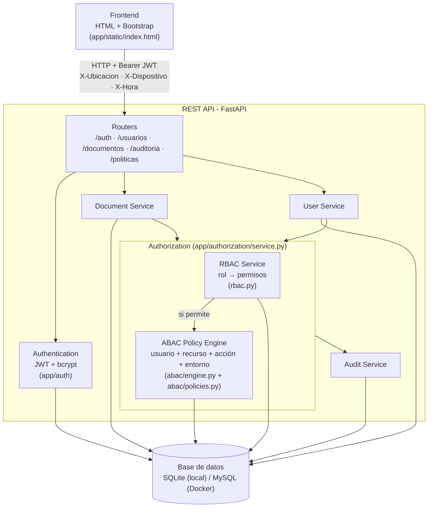
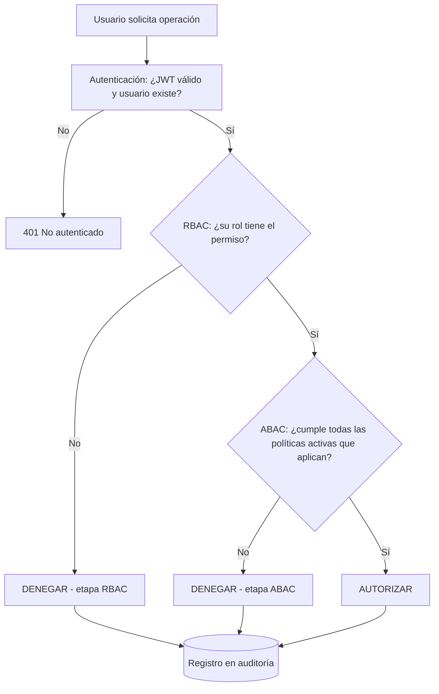

# Diagrama de arquitectura

## Flujo de una petición

## Componentes

| Componente | Archivo | Responsabilidad |
|---|---|---|
| Authentication | `app/auth/security.py`, `app/auth/dependencies.py`, `app/services/auth.py` | Login, hash de contraseñas, emisión y validación del JWT, atributos del entorno |
| RBAC Service | `app/authorization/rbac.py` | Resolver usuario → rol → permisos desde la BD |
| ABAC Policy Engine | `app/authorization/abac/engine.py` | Cargar las políticas activas, decidir cuáles aplican y evaluarlas |
| Catálogo de políticas | `app/authorization/abac/policies.py` | Una función por política, sin condicionales por rol |
| Authorization Service | `app/authorization/service.py` | Orquestar RBAC → ABAC y registrar la decisión |
| Document / User Service | `app/services/documentos.py`, `app/services/usuarios.py` | Lógica de negocio; toda operación pasa por el Authorization Service |
| Audit Service | `app/services/auditoria.py` | Guardar y consultar cada intento de acceso |

## Cómo se evita el "if rol == ADMIN"

- Los permisos por rol están en las tablas `roles`, `permisos` y `rol_permiso`.
- Las políticas ABAC están en la tabla `politicas`. Cada una guarda en `parametros` (JSON) a qué
  acciones aplica, qué roles están exentos (`roles_exentos`) o a qué roles se limita (`roles`), y sus
  valores (niveles, horario, dispositivos permitidos...).
- El motor ABAC decide si una política aplica solo con esos parámetros, y cada política es una
  función pura. Para cambiar una regla (por ejemplo, el horario o quién está exento) se edita la
  política desde `PUT /politicas/{codigo}` o desde la pestaña "Políticas ABAC", sin tocar el código.
