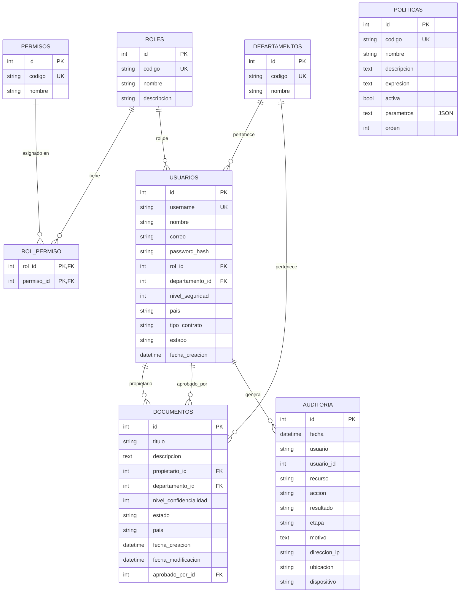

# Modelo de base de datos

## Notas

- `auditoria.usuario` guarda el username como texto (no solo la FK) para que el registro se
  mantenga aunque el usuario se elimine y para auditar intentos de login con usuarios que no existen.
- Estados de documento: `BORRADOR`, `PENDIENTE`, `APROBADO`, `PUBLICADO`.
- Estados de usuario: `ACTIVO`, `INACTIVO`, `SUSPENDIDO`. Contrato: `INTERNO`, `EXTERNO`.
- Las tablas se crean solas al iniciar la app (`Base.metadata.create_all`) y se cargan los datos de
  ejemplo de `app/seed.py` si la BD está vacía.
