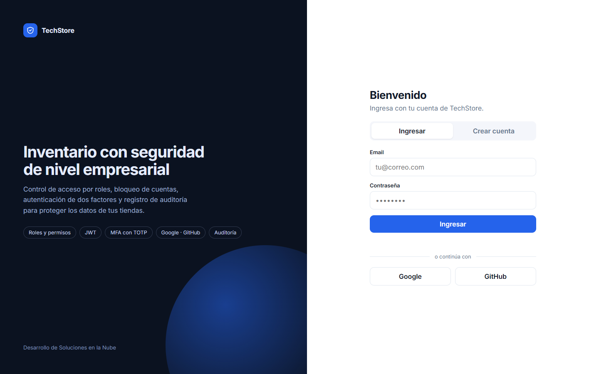
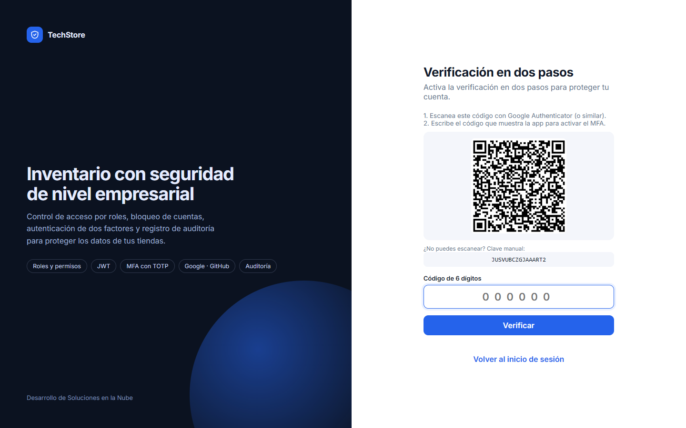
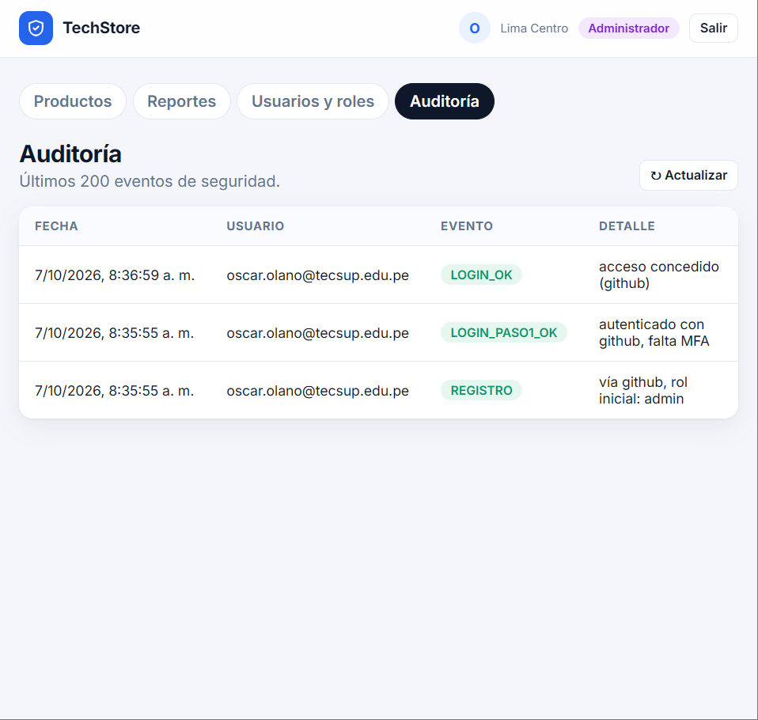
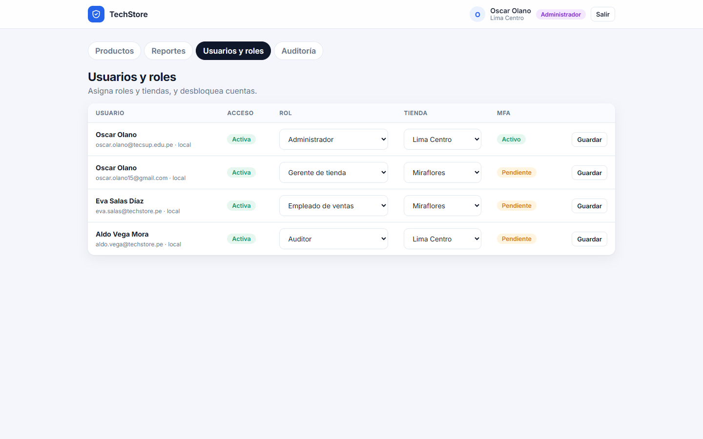
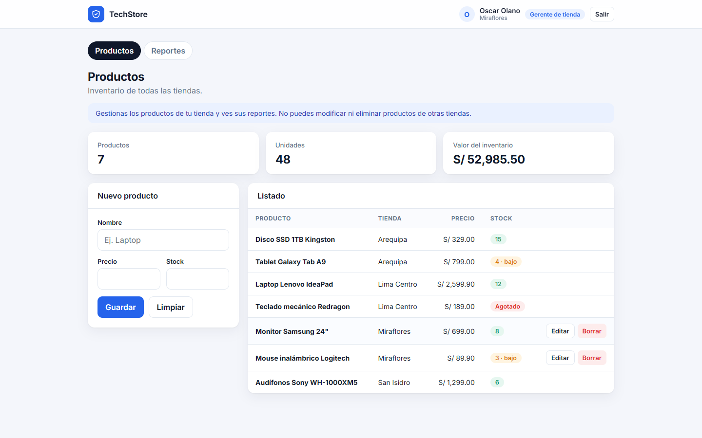
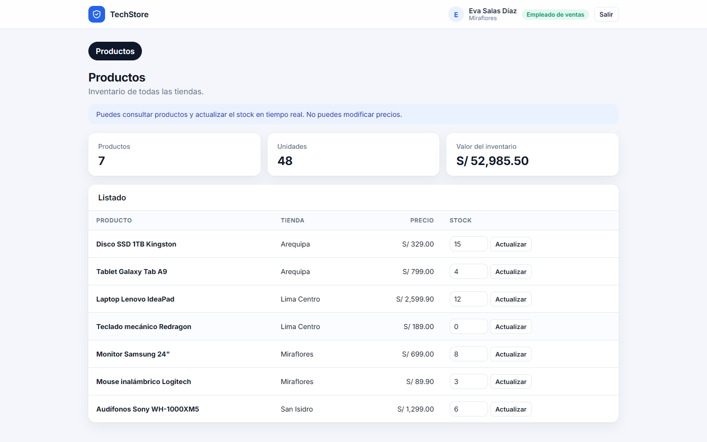
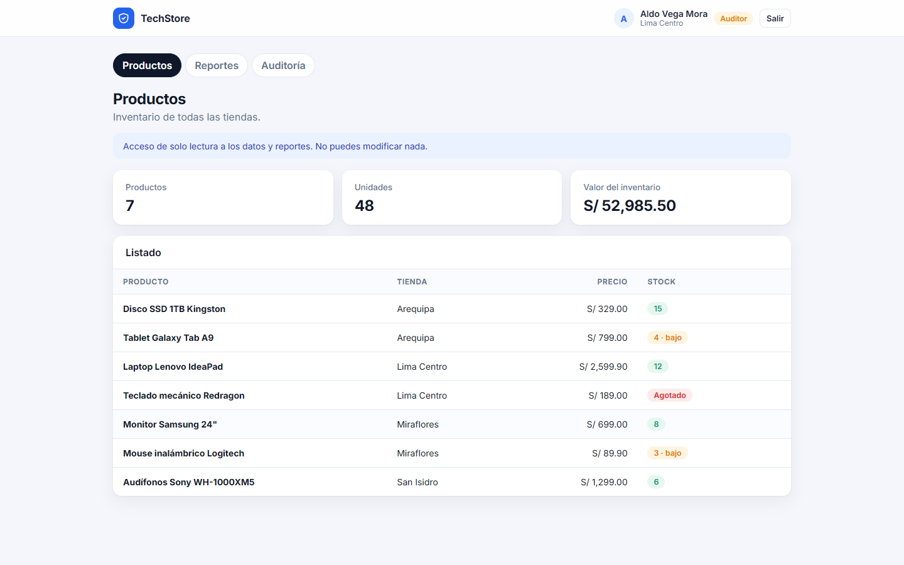

# Semana 08 — Seguridad en la nube

**Laboratorio calificado · TechStore:** sistema de inventario con registro, login, MFA y roles.

| | |
|---|---|
| **Alumno** | Oscar Olano — [@oscarjscom](https://github.com/oscarjscom) |
| **Docente** | Jaime Farfán Madariaga |
| **Institución** | Tecsup — Departamento de Tecnología Digital |
| **Curso** | Desarrollo de Soluciones en la Nube — 5 C24 |

## Qué hace

- Registro con email único y contraseña fuerte.
- Login con JWT y bloqueo de la cuenta a los 5 intentos fallidos.
- Login con Google y GitHub.
- MFA con código TOTP (Google Authenticator).
- 4 perfiles: administrador, gerente, empleado y auditor, cada uno con sus permisos.
- Auditoría de los accesos y cambios.

## Capturas

| | |
|---|---|
|  |  |
|  |  |
|  |  |
|  |  |

## Cómo ejecutarlo

```bash
cd "Semana 08 - TechStore Seguridad en la nube"
npm install
npm start
```

Antes de arrancar, copia `.env.example` como `.env` y completa los valores. El `.env` no se sube al repositorio.
